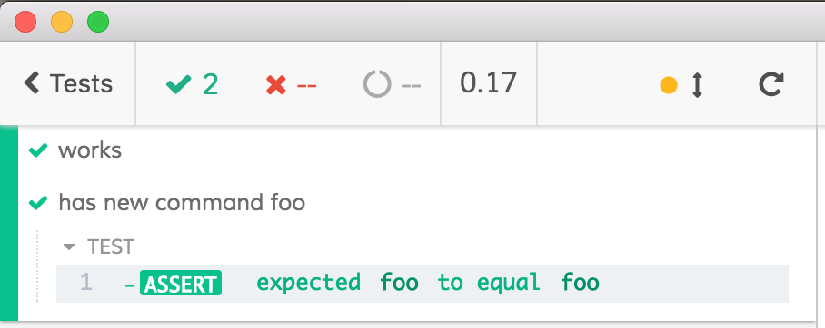
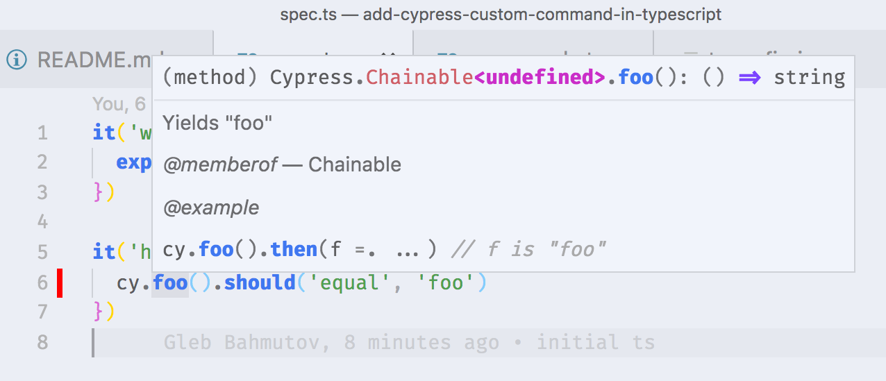

 [![renovate-app badge][renovate-badge]][renovate-app]

To add TypeScript support to Cypress

* `npm i -D @bahmutov/add-typescript-to-cypress`
* add [tsconfig.json](tsconfig.json)
* start using TypeScript in your [cypress/integration/spec.ts](cypress/integration/spec.ts)
* you can write [custom Cypress commands](https://on.cypress.io/custom-commands) in TypeScript, see example in [cypress/support/commands.ts](cypress/support/commands.ts) to add custom commands.

## Screenshots

* passing tests that exercise custom commands

* VSCode IntelliSense correctly shows `cy.foo()` docs

## Problems

If you hit a problem, please open an issue either in this repo or in [cypress-io/cypress](https://github.com/cypress-io/cypress) with reproducible source code. The best issues are the ones we can "git clone ...", install dependencies and run to see the problem. This ensures we can fix it quicker.

## Additional information

- [bahmutov/add-typescript-to-cypress](https://github.com/bahmutov/add-typescript-to-cypress)
- [Cypress Tooling: TypeScript](https://on.cypress.io/typescript-support)

[renovate-badge]: https://img.shields.io/badge/renovate-app-blue.svg
[renovate-app]: https://renovateapp.com/
